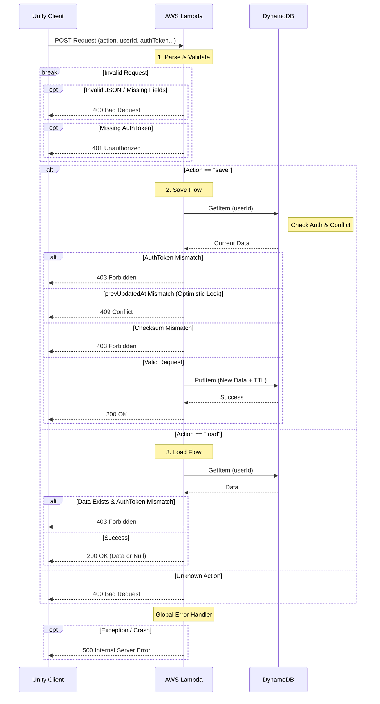

# 10. Backend Implementation (AWS Lambda & DynamoDB)

本ドキュメントでは、クラウドセーブ機能を提供するバックエンド（サーバーサイド）の実装詳細について解説します。

## 1. 技術スタック

*   **Runtime:** Node.js (TypeScript)
*   **Compute:** AWS Lambda
*   **Database:** Amazon DynamoDB
*   **SDK:** AWS SDK for JavaScript v3
*   **Crypto:** Node.js Crypto Module (HMAC SHA256)

## 2. コード解説 (`Backend/src/index.ts`)

このLambda関数は、UnityクライアントからのHTTPリクエストを受け取り、DynamoDBに対してデータの保存（Save）、読み込み（Load）、削除（Delete）を行います。

### 2.1 AWS SDK v3 の採用
従来の v2 と異なり、v3 はモジュール化されており、必要な機能だけをインポートできるため、Lambdaの起動時間（コールドスタート）を短縮できます。

```typescript
import { DynamoDBClient } from "@aws-sdk/client-dynamodb";
import { DynamoDBDocumentClient, PutCommand, GetCommand } from "@aws-sdk/lib-dynamodb";
```

*   **`DynamoDBClient`**: 基本的な通信クライアント。
*   **`DynamoDBDocumentClient`**: データをJSONオブジェクトとして直感的に扱えるようにするラッパー。これを使うことで、DynamoDB特有の型記述（`{"S": "text"}`など）を意識せずに済みます。

### 2.2 ハンドラー関数と非同期処理
Lambdaのエントリーポイントは `handler` 関数です。`async/await` 構文を使用して、非同期なDB操作を同期的に記述しています。

```typescript
export const handler = async (event: any) => {
    // ...
    const response = await docClient.send(command);
    // ...
};
```

### 2.3 リクエスト処理フロー

1.  **パース:** `event.body` (JSON文字列) をオブジェクトに変換します。
2.  **バリデーション:** 必須項目 (`userId`, `authToken`) があるか確認します。
3.  **分岐:** `action` (`save` / `load`) に応じて処理を分けます。
4.  **セキュリティチェック:**
    *   **認証:** `authToken` がDB上の値と一致するか確認します。
    *   **改竄検知:** 送られてきたデータからハッシュ値を再計算し、`checksum` と一致するか確認します。
    *   **整合性チェック:** `save` アクションの場合、`prevUpdatedAt` が現在のDB上の `updatedAt` と一致するか確認します（楽観的ロック）。
5.  **DB操作:** `PutCommand` や `GetCommand` を作成し、`docClient.send()` で実行します。
6.  **レスポンス:** 結果をJSON文字列として返します。

### 2.3.1 エラーハンドリング (Error Handling)
この関数は、予期せぬエラーが発生してもサーバー全体が停止しないように、また、クライアントに適切なフィードバックを返せるように設計されています。

1.  **リクエスト検証エラー (`4xx`系):**
    *   クライアントからのリクエスト内容に不備がある場合に返されます。
    *   **`400 Bad Request`**: `userId` がない、JSONの形式が不正など、リクエストそのものが間違っている場合。
    *   **`401 Unauthorized`**: `authToken` がない場合。
    *   **`403 Forbidden`**: `authToken` や `checksum` が不正で、アクセス権限がないと判断された場合。
    *   **`409 Conflict`**: データが他の端末で更新されており、競合が発生した場合。

2.  **サーバー内部エラー (`5xx`系):**
    *   `try-catch` ブロック全体で予期せぬエラーを捕捉します。
    *   **`500 Internal Server Error`**: プログラムのバグ、AWSサービスの一時的な障害など、サーバー側で問題が発生した場合。
    *   この場合、エラーの詳細はクライアントには返さず、AWS CloudWatchにログとして記録されます。これにより、セキュリティを確保しつつ、開発者は後から原因を調査できます。

```typescript
// index.ts のエラーハンドリング構造
export const handler = async (event) => {
    try {
        // 正常系の処理...
        // if (エラー条件) return { statusCode: 400, ... };
    } catch (error) {
        // 予期せぬエラーはここでキャッチ
        console.error(error);
        return { statusCode: 500, ... };
    }
};
```

### 2.3.2 処理フロー図 (Process Flow Diagram)




### 2.4 セキュリティ対策 (Security Measures)

#### トークン認証 (Token Authentication)
単純なID指定だけでは他人のデータを上書きできてしまうため、`authToken` による簡易認証を実装しています。

*   **Load時:** DBに保存されているトークンと、リクエストのトークンが一致するか確認。
*   **Save時:**
    *   新規データならそのまま保存（トークンも登録）。
    *   既存データがある場合、トークンが一致しなければ `403 Forbidden` を返し、上書きを拒否します。

#### 2.4.1 改竄の手口と対策

セーブデータの改竄（チート）は、主に以下の方法で行われます。

1.  **通信内容の書き換え:**
    *   **手口:** PCとサーバー間の通信を傍受するツールを使い、送信するJSONデータの中身（例: `"score": 100`）を不正な値（`"score": 9999999`）に書き換えてからサーバーに送信する。
    *   **対策:** 今回実装した**チェックサム（HMAC）**がこれに有効です。データが1文字でも改竄されると、クライアントが生成したチェックサムとサーバー側で再計算したチェックサムが一致しなくなるため、不正なリクエストとして検知・拒否できます。

2.  **ローカルファイルの書き換え:**
    *   **手口:** PC内に保存されているセーブファイルや設定ファイル（Windowsのレジストリなど）を直接編集して値を書き換える。
    *   **対策:** 重要なデータはローカルに保存せず、常にサーバーからロードする（今回のクラウドセーブの設計）。また、ローカルに保存せざるを得ないデータは暗号化するなどの対策があります。

本プロジェクトでは、まず最も狙われやすい「通信内容の書き換え」をチェックサムによって防いでいます。

#### 改竄検知 (Tamper Detection / Checksum)
通信経路やクライアント側でのデータ改竄を防ぐため、HMAC (Hash-based Message Authentication Code) を使用したチェックサム検証を行っています。

1.  **Unity側:** `saveData` (JSON文字列) と `authToken` (秘密鍵として使用) から SHA256 ハッシュ値を計算し、`checksum` として送信。
2.  **Lambda側:** 受け取った `saveData` と、DBに保存されている `authToken` を使って同様にハッシュ値を計算。
3.  **検証:** 送られてきた `checksum` と計算結果が一致しない場合、データが改竄されたとみなして保存を拒否します。

**キー順序の安定化:**
`JSON.stringify` はキーの順序を保証しないため、クライアントとサーバーで生成される文字列が異なる可能性があります。これを防ぐため、キーを必ずアルファベット順にソートしてから文字列化する `json-stable-stringify` ライブラリを使用しています。

```typescript
import { createHmac } from "crypto";
import stringify from "json-stable-stringify";

const dataString = JSON.stringify(saveData);
const expectedChecksum = createHmac('sha256', authToken)
                           .update(dataString)
                           .digest('hex');

if (checksum !== expectedChecksum) {
    return { statusCode: 403, body: JSON.stringify({ message: "Invalid checksum" }) };
}
```

### 2.5 データ整合性 (Data Consistency)
複数端末での同時プレイや、通信環境の悪化による「先祖返り（古いデータによる上書き）」を防ぐため、**楽観的ロック (Optimistic Locking)** を採用しています。

1. **Load時:** クライアントにデータと共に `updatedAt` (最終更新日時) を返します。
2. **Save時:** クライアントは保存リクエストに `prevUpdatedAt` を含めます。
3. **検証:** サーバーは `prevUpdatedAt` がDB上の現在の `updatedAt` と一致するか確認します。
   - 不一致の場合、**`409 Conflict`** エラーを返し、保存を拒否します。
   - クライアントはこのエラーを受け取ると、ユーザーに「リロード」か「強制上書き」の選択を求めます。

### 2.6 TTL (Time To Live) の実装
データが増え続けるのを防ぐため、DynamoDBのTTL機能を利用して「1年後に自動削除」されるように設定しています。

```typescript
// 現在時刻 + 1年 (秒単位のUnixタイムスタンプ)
const oneYearLater = Math.floor(now.getTime() / 1000) + (365 * 24 * 60 * 60);

const command = new PutCommand({
    // ...
    Item: {
        // ...
        expiresAt: oneYearLater // DynamoDBがこの時間を過ぎると自動削除する
    }
});
```

この設定により、`expiresAt` カラムに保存された時刻（Unix Timestamp）を過ぎると、AWS側が自動的にデータを削除してくれます。
