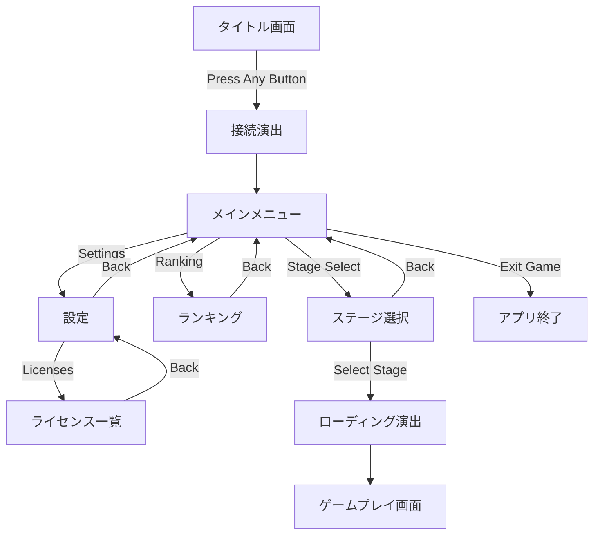

# UI Design Specification

## 1. 概要
本ドキュメントは、ReactUnityを用いて実装される「GeomeTRIo」のUIデザイン、演出、および画面遷移の仕様を定義する。

## 2. コンセプトとストーリー
### 2.1 ストーリー背景

**「幾何学の防衛網を突破せよ」**
プレイヤーは、高度なハッキング能力を持つ「侵入者」である。ターゲットは、純粋な数学的秩序によって構築された極秘サーバー「GeomeTRIo（ジオメトリオ）」。この空間は、不正なデータを「歪な図形」として排除する幾何学的な防衛システムによって守られている。プレイヤーはコンソールを駆使して接続を確立し、防衛網の深部（ゲーム本編）へと侵入を試みる。

### 2.2 デザインテーマ
*   **Geometric Cyberpunk**: 無機質な幾何学図形（三角形、四角形、グリッド）と、サイバーパンク的な発光表現を融合。
*   **Colors**:
    *   **Base**: Deep Navy / Black (`#0f172a`, `#000000`) - 深淵な電脳空間。
    *   **Accent (System)**: Cyan (`#00ffff`) - 電脳空間のグリッド、正常なデータ、リンク。
    *   **Accent (Player/Intruder)**: White (`#ffffff`) - プレイヤー、侵入者。メニューカーソルと同期させる。
    *   **Accent (Enemy/Alert)**: Red (`#ff3333`) - エラー、警告、敵性データ。
*   **Glitch & Noise**: 完璧な秩序に対する「異物」としての侵入感を出すため、ロゴやUIに時折グリッチ（ノイズ、色ズレ）を発生させる。

## 3. 画面仕様
### 3.0 共通仕様 (General Specs)
*   **解像度 (Resolution)**:
    *   1920x1080 (16:9) を基準デザインとする。
    *   異なるアスペクト比のデバイスでは、画面中央に16:9の領域を確保し、余白には黒帯を表示する（レターボックス/ピラーボックス）。
    *   UI要素はスケーリングされ、常に画面内に収まるように表示される。

### 3.1 タイトル画面 (Title Screen)
*   **背景演出**:
    *   **GridBackground**: 空間の奥行きと広がりを表現するため、シアン色のグリッドラインがスクロールする。
    *   **GeometricDebris**: 三角形（自機モチーフ）や四角形（敵モチーフ）のパーティクルが浮遊・回転し、動的な空間を演出する。
    *   **Vignette**: 画面四隅を暗くし、CRTモニターや没入感を強調する。
*   **ロゴ (GlitchLogo)**:
    *   画面中央上部に配置。
    *   ランダムなタイミングでRGBシフト（赤・シアンのズレ）と位置ズレが発生し、不安定な接続状態を示唆する。
*   **開始プロンプト**:
    *   "PRESS ANY BUTTON" を点滅表示。
    *   入力待ち状態 (`idle`)。
    *   **スキップ機能**: ゲームプレイからタイトルに戻った場合は、この画面と接続演出をスキップし、直接メインメニューを表示する。

### 3.2 接続シーケンス (Connection Sequence)
*   **トリガー**: タイトル画面での任意キー入力。
*   **演出**:
    *   プロンプトが消え、コンソールウィンドウが出現。
    *   ハッキングログ（"ESTABLISHING CONNECTION...", "BYPASSING FIREWALL..." 等）が順次表示される。
    *   **侵入成功**: 最後に "SYSTEM ALERT: INTRUDER DETECTED" が表示されると同時に、画面全体が赤くフラッシュ（Red Flash）し、メニュー画面へ遷移する。これは、システムに侵入した瞬間に警報が作動したことを表現している。

### 3.3 メインメニュー (Main Menu)
*   **状態**: 接続済み (`connected`)。
*   **レイアウト**:
    *   画面左側にメニュー項目をリスト表示。
    *   **項目**: Stage Select, Ranking, Settings, Exit Game。
*   **インタラクション**:
    *   **選択**: 矢印キー/WASD。選択中の項目は背景が伸び、矢印（▶）が表示される。
    *   **決定**: Enter/Aボタン。
    *   **戻る**: Esc/Bボタン。接続を切断し、タイトル画面へ戻る（ログアウト演出）。
    *   **フォーカス記憶**: 各サブ画面から戻ってきた際、直前に選択していたカーソル位置を記憶・復元する。
*   **フッター (Footer)**:
    *   画面最下部に黒帯で操作ガイドを表示。
    *   キーボード操作とコントローラー操作（Nintendo Switch配置準拠: A決定/B戻る）を併記。

### 3.4 サブ画面
*   **Stage Select**:
    *   ゲームを開始するステージを選択する画面。
    *   **項目**: Stage 1, Score Attack。
    *   **ローディング**: 選択後、"LOADING" とスピナーを表示。ロード完了後、画面を暗転（フェードアウト）させてからシーン遷移を行う。
    *   選択すると対応するUnityシーンへ遷移し、ゲームプレイを開始する。
*   **Ranking**:
    *   スコアランキングを表示。
    *   **フィルタ機能**: HP設定、SP設定、AutoFire設定で表示するスコアを絞り込み可能。
    *   **表示項目**: 順位、スコア、達成時の設定 (HP/SP/Auto)、達成日時。
    *   **表示制限**: レイアウト崩れ防止のため、フィルタリング後の上位5件のみを表示する。
*   **Settings**:
    *   ゲーム設定を変更する画面。2カラム構成（左：カテゴリ、右：項目）。
    *   **カテゴリ**:
        *   **GAMEPLAY**: 初期HP (1-10), 初期SP (0-10), Auto Fire (ON/OFF)。
        *   **AUDIO**: BGM Volume (0-100), SE Volume (0-100)。
        *   **SYSTEM**: Player Name, Vibration (ON/OFF), CRT Filter (ON/OFF)。
        *   **STATS**: プレイ統計情報（総プレイ時間、累計スコア、撃破数、SP使用回数、誘爆数、アイテム取得数、与ダメージなど）を閲覧。
        *   **ABOUT**: バージョン情報、開発者名、ライセンス情報の閲覧。
        *   **RESET**: 全設定を初期値に戻す（統計情報は維持される）。
            *   **確認ダイアログ**: 実行前に全画面を覆う警告ダイアログを表示する。
                *   **WARNING**: 赤色でグリッチ演出を行い、危険な操作であることを強調する。
                *   **背景**: 不透明度95%の黒で画面全体を覆い、背面の要素を隠蔽する。
                *   **ボタン**: YES（赤背景/白文字）、NO（シアン背景/白文字）。
            *   **DELETE SAVE DATA**: 実行後、ローカルデータとPlayerPrefsを削除し、タイトル画面（Press Any Button）へリロードする。
    *   **スクロール**:
        *   項目数が多く画面に収まらない場合、選択中の項目が常に表示範囲内（上から2番目付近）に来るように、リスト全体が自動的にスクロールする。
    *   **Player Name入力**:
        *   決定キーで編集モードに入り、上下キーで文字変更（ドラムロール）、左右キーでカーソル移動。
        *   使用可能文字: 英大文字、数字、記号 (`-`, `.`, `_`, `!`, `?`, `&`, `@`)。
        *   バックスペース（キーボード: Backspace, ゲームパッド: 西ボタン）で文字削除が可能。
        *   カーソルは文字の上にある場合はその文字を削除（Delete挙動）、末尾にある場合は直前の文字を削除（Backspace挙動）する。
    *   **保存**: 画面から戻る際に一括で保存される。
    *   **視覚効果**: カテゴリ選択時にボタンが白く発光するフィードバックを行う。
*   **LicenseMenu**:
    *   使用しているサードパーティ製ソフトウェア（Unityパッケージ、npmパッケージ）のライセンス一覧を表示。
    *   **レイアウト**: 左側にライブラリ名リスト、右側に選択したライブラリのライセンス本文を表示。
    *   **スクロール**:
        *   リスト: 項目数が多い場合、カーソル移動に合わせてスクロールする。
        *   本文: 上下キーでスクロール可能。
    *   **データソース**: ビルド時に生成されたJSONファイル (`unity-licenses.json`, `web-licenses.json`) を読み込む。
*   **Exit Game**:
    *   アプリケーションを終了する。
    *   "SHUTTING DOWN..." のメッセージを表示し、フェードアウト後に終了処理を実行する。

### 3.5 ゲームプレイ画面 (HUD)
*   **開始演出 (Boot Sequence)**:
    *   画面中央にターミナルウィンドウが出現し、起動ログが流れる。
    *   ログの進行に合わせて、HUDの各パーツ（枠、ラベル、数値、ステータス）が順次フェードインする。
    *   最後に "MISSION START" が表示されると同時にウィンドウがグリッチノイズと共に消滅し、暗転が解除されてゲームが開始される。
*   **Status Monitor**:
    *   右下に常時表示。SYSTEM, ENGINE, WEAPON の3項目。
    *   **異常状態**: HP低下時やゲームオーバー時は、ステータス名が変化し（例: ENGINE: DESTROYED）、赤色で点滅（Pulse）する。
*   **ゲームオーバー**:
    *   "GAME OVER" の文字と共に、リトライ/メニューへ戻るボタンを表示。
    *   ハイスコア更新時は "NEW HIGH SCORE!" を点滅表示する。

## 4. UI/UX演出意図
*   **没入感の向上**: 単なるメニュー遷移ではなく、「サーバーへの接続」という儀式を経ることで、ゲームの世界観への没入を促す。
*   **視認性と雰囲気の両立**: フォントには可読性の高いサンセリフ体と、雰囲気重視の等幅フォント（SourceHanCodeJP等）を使い分ける。
*   **操作フィードバックの最適化**: カーソル移動音などのSEは、実際に項目が移動した時のみ再生し、端での連打による不快な音の重複を防ぐ。