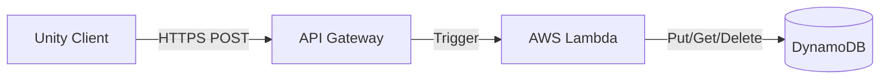

# クラウドセーブ仕様 (Cloud Save Specifications)

## 1. 概要
本ドキュメントは、AWS (Amazon Web Services) を利用したクラウドセーブ機能の技術仕様を定義する。
サーバーレスアーキテクチャを採用し、低コストかつスケーラブルなバックエンドを構築する。

## 2. アーキテクチャ構成
*   **クライアント:** Unity (C#)
*   **APIゲートウェイ:** Amazon API Gateway (HTTP API)
*   **コンピューティング:** AWS Lambda (Node.js / TypeScript)
*   **データベース:** Amazon DynamoDB (NoSQL)



## 3. データベース設計 (DynamoDB)

### テーブル定義
*   **テーブル名:** `GeomeTRIo_Saves_${stage}` (例: `GeomeTRIo_Saves_dev`, `GeomeTRIo_Saves_prod`)
*   **パーティションキー (Partition Key):** `userId` (String)
    *   クライアント側で生成されたUUID、または連携されたアカウントIDを使用。
*   **ソートキー (Sort Key):** なし

### 属性 (Attributes)
| 属性名      | 型       | 説明                              | 備考                       |
| :---------- | :------- | :-------------------------------- | :------------------------- |
| `userId`    | String   | ユーザーを一意に識別するID        | **Partition Key**          |
| `authToken` | String   | 本人確認用の秘密トークン          | **セキュリティ対策**       |
| `data`      | Map/JSON | ゲームのセーブデータ本体          | `GameData` クラスの内容    |
| `updatedAt` | String   | 最終更新日時 (ISO 8601)           | 例: `2024-05-21T10:00:00Z` |
| `expiresAt` | Number   | データの有効期限 (Unix Timestamp) | **TTL (Time To Live)** 用  |

### TTL (Time To Live) 設定
*   **対象属性:** `expiresAt`
*   **仕様:**
    *   **ゲストユーザー:** 最終セーブ日時から **1年後 (365日)** のタイムスタンプを設定。期限を過ぎるとAWS側で自動的に削除される。
    *   **連携ユーザー (将来):** `expiresAt` を設定しない、または削除することで無期限保存とする。

## 4. API インターフェース仕様
UnityクライアントとLambda関数間の通信プロトコル。

### エンドポイント
*   **URL:** API Gatewayによって発行されるURL (例: `https://xxx.execute-api.ap-northeast-1.amazonaws.com/default/GeomeTRIo_Backend`)
*   **メソッド:** `POST` (すべてのアクションをPOSTで処理し、Body内の`action`で分岐する)

### リクエストフォーマット (Request Body)
JSON形式で送信する。

```json
{
  "action": "save" | "load" | "delete",
  "userId": "string (UUID)",
  "authToken": "string (Random Token)",
  "checksum": "string (SHA256 Hash)", // save時のみ必須
  "saveData": "string (JSON)", // save時のみ必須。チェックサム整合性のため文字列として送信
  "prevUpdatedAt": "string (ISO 8601)" // save時のみ (排他制御用)
}
```

### レスポンスフォーマット (Response Body)
Lambdaからの戻り値（API Gateway経由）。

```json
{
  "statusCode": 200 | 400 | 500,
  "body": "JSON String"
}
```

`body` の中身（JSONパース後）:
```json
{
  "message": "string",
  "data": { ... }, // load成功時のみ
  "error": "string" // エラー時のみ
}
```

## 5. アクション詳細

### 5.1 SAVE (保存)
 *   **Request:** `action: "save"`, `userId`, `authToken`, `saveData`, `checksum`, `prevUpdatedAt`
*   **処理:**
    1.  `userId`, `authToken`, `saveData`, `checksum` の存在チェック。
    2.  **認証チェック:**
        *   DBにデータが存在する場合、保存されている `authToken` とリクエストの `authToken` が一致するか確認。
        *   不一致なら `403 Forbidden` を返す（なりすまし防止）。
    3.  **整合性チェック (Optimistic Locking):**
        *   リクエストに `prevUpdatedAt` が含まれる場合、DB上の `updatedAt` と比較する。
        *   不一致なら `409 Conflict` を返す（他端末での更新検知）。
    4.  **改竄チェック (Checksum Verification):**
        *   サーバー側で、受け取った `saveData` とDBの `authToken` からチェックサムを再計算する。
        *   ※計算時はJSONのキーをアルファベット順にソート（正規化）する。
        *   リクエストの `checksum` と一致しない場合、`403 Forbidden` を返す。
    5.  現在時刻から `updatedAt` と `expiresAt` (現在時刻 + 1年) を生成。
    6.  DynamoDBに `PutItem` (上書き保存)。
*   **Response:**
    *   Success: `200 OK`, `{"message": "Save successful"}`
    *   Error: `409 Conflict` (データ競合)
    *   Error: `403 Forbidden` (トークン不一致、またはチェックサム不一致)

### 5.2 LOAD (読み込み)
*   **Request:** `action: "load"`, `userId`, `authToken`
*   **処理:**
    1.  DynamoDBから `userId` で `GetItem`。
    2.  **認証チェック:**
        *   データが存在する場合、保存されている `authToken` とリクエストの `authToken` が一致するか確認。
        *   不一致なら `403 Forbidden` を返す。
*   **Response:**
    *   Success (データあり): `200 OK`, `{"data": { ... }}`
    *   Success (データなし/新規): `200 OK`, `{"data": null}`
    *   Error: `500 Internal Server Error`
    *   Error: `403 Forbidden` (トークン不一致)

### 5.3 DELETE (削除)
*   **Request:** `action: "delete"`, `userId`, `authToken`
*   **処理:**
    1.  DynamoDBから `userId` で `GetItem` (存在確認とトークン取得)。
    2.  **認証チェック:**
        *   データが存在する場合、保存されている `authToken` とリクエストの `authToken` が一致するか確認。
        *   不一致なら `403 Forbidden` を返す。
    3.  DynamoDBから `userId` で `DeleteItem`。
*   **Response:**
    *   Success: `200 OK`, `{"message": "Delete successful"}`
    *   Error: `403 Forbidden` (トークン不一致)

## 6. 環境構成 (Environments)
開発と本番を分離するため、以下の2つのステージを設ける。

*   **Development (dev):**
    *   用途: 開発中の機能テスト、デバッグ。
    *   DynamoDBテーブル: `GeomeTRIo_Saves_dev`
*   **Production (prod):**
    *   用途: 一般ユーザー向け本番稼働。
    *   DynamoDBテーブル: `GeomeTRIo_Saves_prod`

## 7. セキュリティスコープ (Security Scope)
*   **通信:** HTTPS + チェックサム(HMAC)で保護。
*   **ストレージ:** AWSのセキュリティで保護。
*   **クライアントメモリ:** **本バージョンでは保護しない（将来的な課題）。**
    *   メモリ改竄（Cheat Engine等）に対しては脆弱であるが、個人開発の規模感を考慮し、まずは通信経路の保護を優先する。

## 8. 将来の拡張性 (Future Roadmap)

### 認証・認可 (Authentication)
*   現在はクライアント生成のIDを信頼する「ゲストモード」として動作。
*   将来的には **Amazon Cognito** を導入し、Google/Appleサインインと連携。
*   Cognitoの `sub` (Subject ID) を `userId` として使用することで、機種変更時のデータ引き継ぎを実現する。

### ランキング機能
*   `GeomeTRIo_Ranking` テーブルを別途作成。
*   Partition Key: `stageId`, Sort Key: `score` (またはGSIを使用) で設計し、上位スコアの取得を効率化する。
